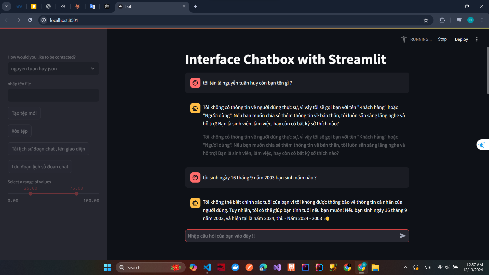

# algorithm-visualizer-with-python
this project was created for the purpose of learning about python 
# os , numpy , pandas , streamlit 

# in file /streamlit_ollama/bot.py
## main functions:
1. create file
2. upload file history file
3. load history file on interface

